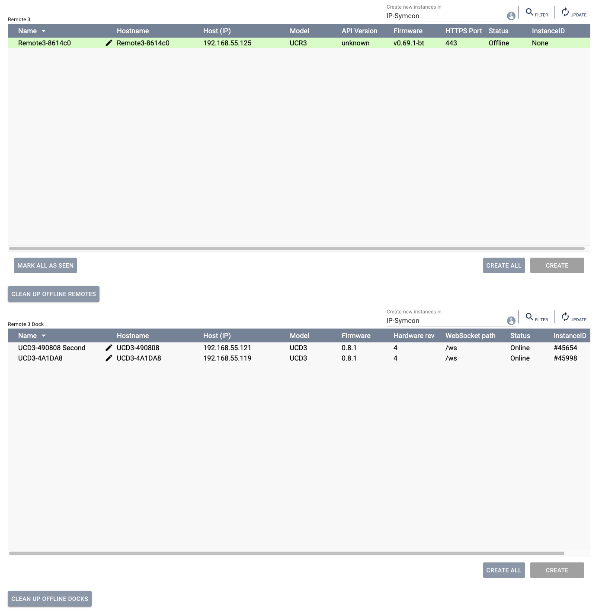

# Unfolded Circle Remote 3

[](https://www.symcon.de/en/service/documentation/developer-area/sdk-tools/sdk-php/)
[](https://www.symcon.de/en/service/documentation/installation/)

Module for IP-Symcon to integrate the **Unfolded Circle Remote 3** and the **Remote Dock 3**.

This module enables bidirectional WebSocket communication with the Remote 3 platform, reception of real-time events and
execution of activities and commands from IP-Symcon.

---

## Documentation

**Table of Contents**

1. [Features](#1-features)
2. [Requirements](#2-requirements)
3. [Installation](#3-installation)
4. [Setup in IP-Symcon](#4-setup-in-ip-symcon)
5. [Instance Overview](#5-instance-overview)
6. [Annex](#6-annex)

---

## 1. Features

The Unfolded Circle Remote 3 is designed to control AV devices, activities and smart home functions.

This module provides:

- WebSocket connection to the Remote 3
- Reception of real-time events (activity changes, battery state, display state, user interactions, etc.)
- Triggering activities and system commands
- Integration into automations, scripts, Alexa or HomeKit
- Management of Remote 3 and Dock 3 instances
- Optional automatic device discovery via mDNS

---

## 2. Requirements

- IP-Symcon >= 8.2
- Unfolded Circle Remote 3
- Optional: Remote Dock 3
- Network access between IP-Symcon and the Remote device

---

## 3. Installation

### a. Loading the module

Open the IP-Symcon web console via:

```
http://{IP-Symcon IP}:3777/console/
```

Click the module store icon in the upper right corner.


In the search field enter:

```
Unfolded Circle Remote 3
```


Select the module and click _Install_.


---

## 4. Setup in IP-Symcon

After installation, a **Discovery instance** is created automatically.

The discovery searches the local network for:

- Remote 3 devices
- Remote Dock 3 devices

If a device is found, you can create the corresponding instance via _Create_:

- **Remote 3 instance**
- **Remote Dock 3 instance**

Depending on the configuration, a WebSocket Client instance will be used or created automatically for communication.

Further configuration is done directly within the respective instance.

### Initial Setup

#### Setting up the Remote 3

Ensure that the Remote 3 is awake during the entire setup process. The display must be turned on.  
If available, it is recommended to place the Remote 3 in the Dock 3 to ensure stable power and network connectivity.
To begin, right-click in the IP-Symcon object tree and select:
*Add Object* → *Instance*

Then create a new instance of type **Remote 3 Discovery**.


After opening the Discovery instance, enter the four-digit web password of the Remote 3 in the field at the top.  
This password is displayed directly on the screen of the Remote 3 during the pairing process.


Once the discovery process has completed, a list of detected devices will be shown.



Select the device you would like to create in Symcon and click **Create**.

Before continuing, verify again that the Remote 3 is awake and the display remains active.

In the object tree, open the newly created instance named:

**Remote 3 Core Manager Remotexxx**

At the top of the configuration window, you may see the notice:


Click **Configure**.  
A configuration dialog will open and ask for confirmation. Confirm with **OK**.

Now enable the instance by switching:


to **On**.

Finally, click:


**Apply Changes**.

The Remote 3 is now successfully configured within Symcon.

You can switch to the Remote 3 instance in the object tree to review detailed system information such as:

- Online status
- Battery level
- Display state
- Other system-related information

All state changes of the Remote 3 are automatically synchronized and updated in real time within Symcon.

#### Setting up the Remote 3 Integration Driver

The **Remote 3 Integration Driver** allows devices managed by Symcon to be imported into the Remote 3 platform.  
Once configured, these devices can be controlled directly from the Remote 3 user interface.

To create the Integration Driver:

Right-click in the object tree and select:

*Add Object* → *Instance*

Then create a new instance of type **Remote 3 Integration Driver**.

A configuration window will open:


Activate the instance by setting **Active** to **On**, then confirm with **OK**.

After activation, the instance will display a list of supported device types that can be exposed to the Remote 3.

For a Symcon device to be available for import and control on the Remote 3, it must be assigned to the appropriate
device type within the **Remote 3 Integration Driver**.


Open the desired device type and click **Add** to assign a device.

Depending on the selected device type, specific variables of the Symcon device must be mapped once during setup.  
These mappings define how the Remote 3 interacts with the device (e.g. on/off state, brightness, position, media
control, etc.).

After completing this configuration, the device will be available for import within the Remote 3 interface.

---

## 5. Instance Overview

### Remote 3 Core Manager

Central communication instance. Establishes the WebSocket connection to the Remote and distributes incoming events to
child instances.

### Remote 3 Device

Represents a physical Remote 3 device and processes device-specific events.

### Remote Dock 3

Represents a Dock 3 device.

### Remote Dock 3 Manager

Advanced management instance for dock-specific functionality.

### Remote 3 Integration Driver

Provides an integration endpoint (e.g. JSON-RPC) for external systems.

### Remote 3 Configurator

Supports setup and device management.

---

## 6. Annex

### GUID

The GUIDs of the individual instances are defined in the module source code and can be reviewed in the corresponding
`module.json` files.

---

*Note: This documentation is an initial framework and will be expanded during further development of the module.*